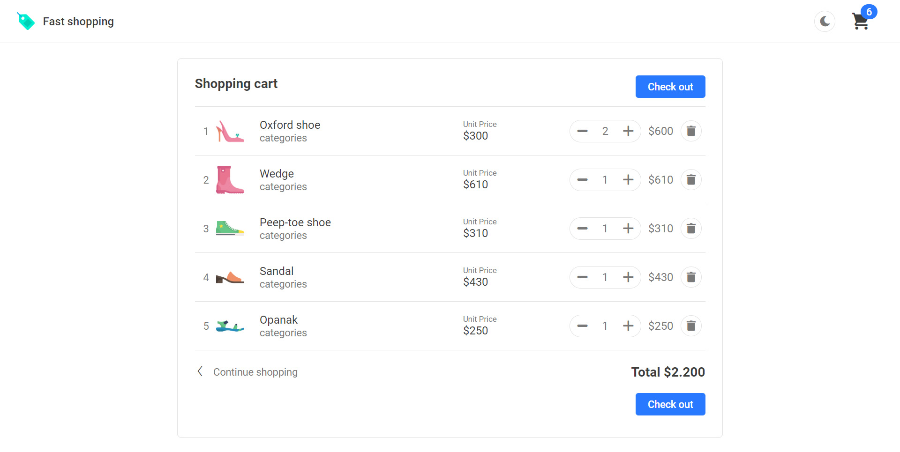

This project was bootstrapped with [Create React App](https://github.com/facebook/create-react-app).

## Demo api/client, with automatic CI/CD

-   SERVER: [https://fastshoppingappserver.azurewebsites.net](https://fastshoppingappserver.azurewebsites.net).
-   CLIENT: [https://fastshopping.z13.web.core.windows.net](https://fastshopping.z13.web.core.windows.net).

### Screenshots

-   Available in dark and light theme

## Available Scripts

### `npm start`

Runs the app in the development mode. 
Open [http://localhost:3000](http://localhost:3000) to view it in the browser.

### `npm test`

### `npm run build`

# Getting Started

1. npm i
2. add your API endpoint in src/appsettings.json, (for production environment, create task to replace varials or the whole file
